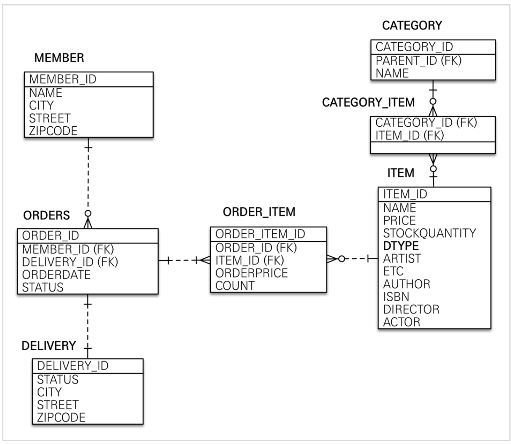
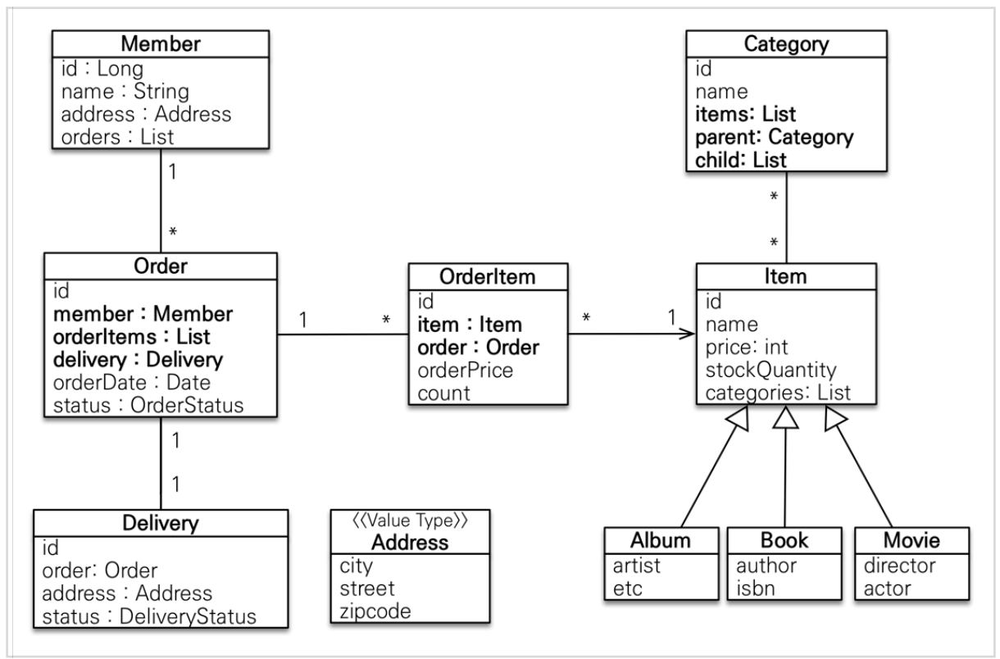

# 42gg-onboarding-be-02

### 개발 환경 세팅

- IDE는 IntelliJ 추천
- IntelliJ Community 버전에서 Ultimate 버전 업그레이드 하기 (학생 라이센스 신청)
    
     Email address : 대학 재학생 혹은 졸업생일 경우 학교 이메일 또는 42계정 이메일(”intraId”@student.42seoul.kr) 사용 가능
    
    https://goddaehee.tistory.com/215
    
- MySQL 설치
    - MySQLWorkbench 이용
    - MySQL workbench에서 외부 접속하기
        
        [https://velog.io/@woals4815/MySQL-외부-접속-하기MySQLWorkbench-이용](https://velog.io/@woals4815/MySQL-%EC%99%B8%EB%B6%80-%EC%A0%91%EC%86%8D-%ED%95%98%EA%B8%B0MySQLWorkbench-%EC%9D%B4%EC%9A%A9)
        
- redis 설치

 

## 공통 조건
- 온보딩 프로젝트는 개인 계정으로 fork하여 진행하고 PR로 제출합니다.
- git / github / code 컨벤션은 42gg notion에 있는 자료를 적극 반영 합니다.  
 

## EX00 Jpa 연관관계 매핑
___
- KeyWords
    - `@Embedded, @Embeddable`
    - `@Inheritance`
        - JOINED
        - SINGLE_TABLE
        - TABLE_PER_CLASS
    - 영속성 컨텍스트, 연관관계 주인
    - `@ManyToOne, @OneToMany`
    - `@OneToOne`
- Entity

 

- Table
